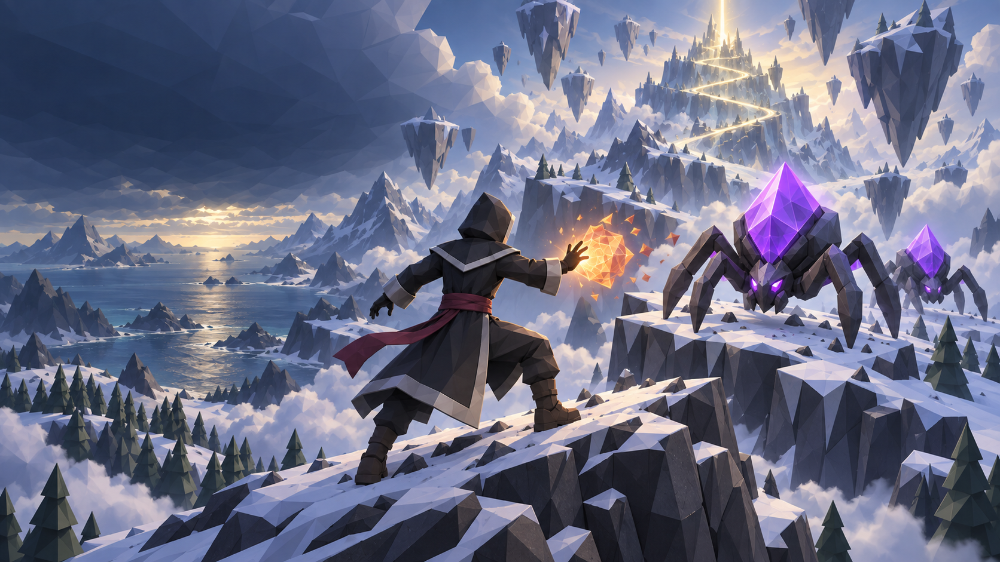

# Galdrava

**Cast. Survive. Ascend.**

Long ago, mountain singers tried to lift their homeland above a gathering darkness; their unfinished chant tore its highest ridges into the sky.
Now wild magic stirs among coastal pines, frozen passes, and floating stone, drawing strange creatures to the rising trail.
You are a wandering spellcaster following that ancient song upward, through a mountain that has never stopped rising.

[**Play in your browser**](https://krusegit.github.io/gamejam-2026/) · [**Download the Windows nightly**](https://github.com/krusegit/gamejam-2026/releases/tag/nightly)

## Play on your phone

Scan the QR code to open [https://krusegit.github.io/gamejam-2026/](https://krusegit.github.io/gamejam-2026/).

## Windows standalone

Download the ZIP from the [nightly release](https://github.com/krusegit/gamejam-2026/releases/tag/nightly).
